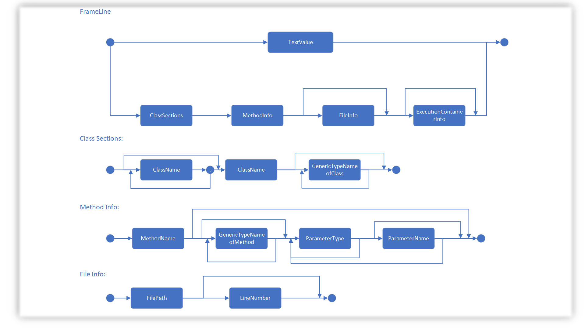
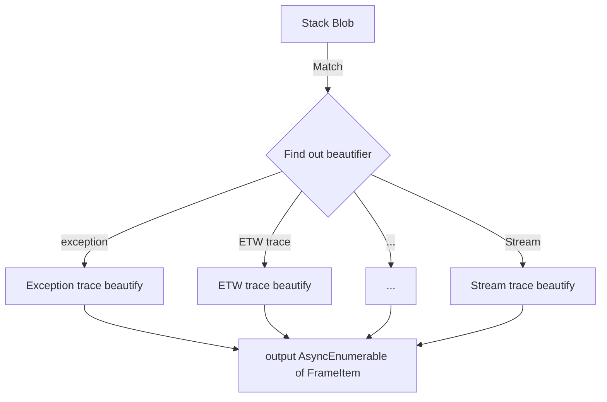

# Stack Beauty

.NET Call Stack is a chuck of text that is not easy to read.
And we shall try to make a change there.

## Vision

This is a service, taking in a chuck of text, understand the semantic of it and beautify it!


## Live site

[Stack Beauty @ stack.codewithsaar.net 🔗](https://stack.codewithsaar.net/)

## Approach

Stacks are similar. We build parsers to understand the text, and unify them into the same syntax:

<p align='center'></p>

There will be the engine, some parsers for .NET to bootstrap the effort. Looking forward to have more contributions on parsers for other languages. If you have any idea/suggestion, [file an issue](https://github.com/xiaomi7732/StackBeauty/issues).

## Challenge

There are various formats for call stack the user could get. And that shouldn't matter to the user. As long as it is a  stack, this service shall be able to recognize it, beautify it and return the result to the user.

## Architecture

```mermaid
graph LR
    A[Input] --> |Pre-Filter| | D(IFrame created & tagged)
    D -->|Parsers| B(IFrameLine collection)
    B -->|Beautifiers| C{Beautified IFrameLine collection}
    C -->|Html Render| D[Html]
    C -->|Text Render| E[Text]
    C -->|... Render| F[...]
```

Generally, once input, callstack will be parsed by parsers; then beautifiers steps in to beautify various parts and output it as json; renders will pick up the json and output it to various results - html; svg; ...


