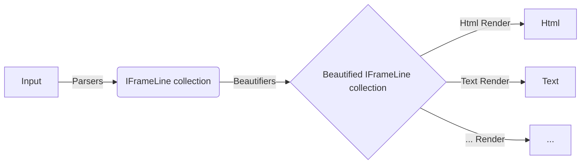
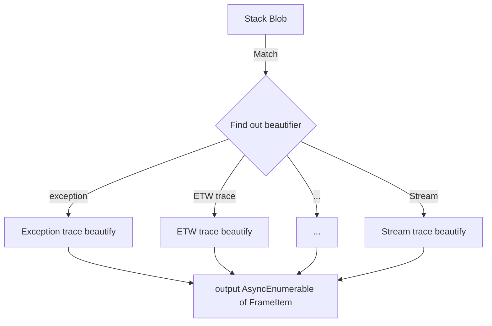

# Stack Beauty

.NET Call Stack is a chuck of text that is not easy to read.
And we shall try to make a change there.

## Vision

This is going to be a service, taking in a chuck of text, understand the type of the call stack, beautify it and then return.

## Live site

[Stack Beauty](http://stackbeauty.codewithsaar.net/)

## Challenge

There are various formats for call stack the user could get. And that shouldn't matter to the user. As long as it is a .NET stack, this service shall be able to recognize it, beautify it and return the result to the user.

## Architecture

Generally, once input, callstack will be parsed by parsers; then beautifiers steps in to beautify various parts and output it as json; renders will pick up the json and output it to various results - html; svg; ...

